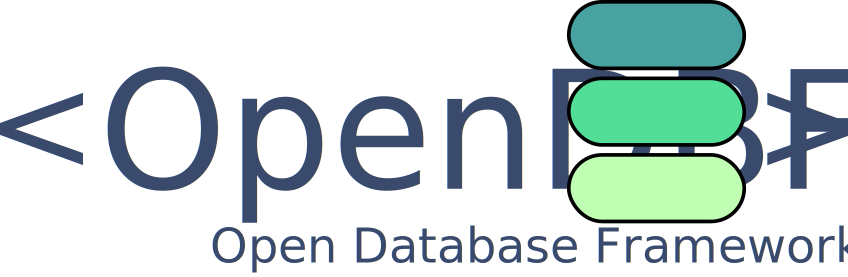

<p align="center">
  
</p>


# OpenDBF
The Open Database Framework is free and open source database library based on object serialization to file.

OpendDBF is a child project of [ReflectXMLDB](https://github.com/Fe-Bell/ReflectXMLDB/).

The project was written with [.NET Standard 2.0](https://docs.microsoft.com/en-us/dotnet/standard/net-standard), 
which is compatible with .NET Core 2.0+, .NET Framework 4.6.1+ and .NET 5.0+.

OpenDBF is cross platform and can run in any OS that supports .NET Core 2.0 or higher.

# Features
- OpenDBF is thread and process safe.
- Provides support for XML, JSON and DAT formats.
- Work with friendly files that can be read by any regular text editor.
- Use simple methods to write/read data to the database files. Forget complex query actions and focus on your actual code.
- It is completely open source and under the very permissive [MIT License](https://github.com/Fe-Bell/OpenDBF/blob/master/LICENSE).!

More to come!

# Get started
Download OpenDBF from our [nuget](https://www.nuget.org/packages/OpenDBF.Core/) links.

OpenDBF offers the traditional Get, Insert, Remove and Update item(s) capabilities commonly present in other database frameworks. Also, it provides a more low level interface with the database files generated, such as the ability to Export and Import the database files to .db files, which are compressed versions of the workspace.
The framework creates a single file for each database initialized and/or instantiated.

There are two steps to get OpenDBF running:
1. Custom objects must inherit from OpenDBF.Shared.Interface.ICollectableObject and be serializable so they can be inserted in the databse.

Example:
```csharp
	[Serializable]
	public class Sample : ICollectableObject
	{
		public string GUID { get; set; }
		public uint EID { get; set; }
		public string SomeData { get; set; }
	}	
```

2. Users must create an instance of an IDatabaseFramework. The OpenDBF.Core offers a factory for that although frameworks can be manually instantiated too.

Example:
```csharp

	//Initializes the database framework.
	var dh = FrameworkFactory.GetFramework(FrameworkFactory.Framework_e.JSON);

	//Creates the workspace.
	string workspace = Path.Combine(Directory.GetCurrentDirectory(), @"DBSample");
	dh.SetWorkspace(workspace);

	//Creates a list of objects to be inserted.
	//Sample inherits from ICollectableObject and is in the same namespace of SampleDatabase
	List<Sample> samples = new List<Sample>();
	for (int i = 0; i < 10; i++)
	{
		samples.Add(new Sample() { SomeData = string.Format("Data{0}", i) });
	}

	//Inserts the items in the database.
	dh.Insert(samples);

	//Gets all samples in the database.
	var queryAllSamples = dh.Get<Sample>();
	//Gets all samples that have Data5 as the value of the SomeData property.
	var querySomeSamples = dh.Get<Sample>(x => x.SomeData == "Data5");

	//Removes some of the items in the database.
	dh.Remove<Sample>(querySomeSamples);

	//Saves the database to a file
	dh.Commit();

	//Exports the database to a .db file.
	dh.Pack(Path.Combine(Directory.GetCurrentDirectory(), @"Place"), "copyOfSampleDatabase1");

	//Removes all "samples" from the database
	dh.DropTable<Sample>();

	//Clears internal resources.
	dh.Dispose();
	
```

Happy coding!

# License
Licensed under [MIT License](https://github.com/Fe-Bell/OpenDBF/blob/master/LICENSE).
